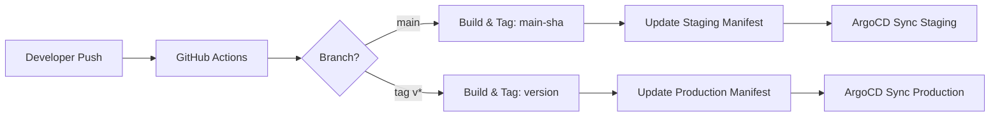

# GitOps Workflow with FastAPI, ArgoCD, and Kubernetes

**Developed by Taruntarz**

This project demonstrates a production-ready GitOps workflow using FastAPI, Docker, Kubernetes, ArgoCD, and GitHub Actions with advanced features like multi-environment deployments, auto-scaling, and comprehensive monitoring.

## 🏗️ Architecture Overview

```
┌─────────────────┐    ┌──────────────────┐    ┌─────────────────────┐
│   Developer     │    │   GitHub Actions │    │   Docker Registry   │
│   Push Code     │───▶│   CI/CD Pipeline │───▶│   (Docker Hub)      │
└─────────────────┘    └──────────────────┘    └─────────────────────┘
                                │                          │
                                ▼                          │
┌─────────────────────────────────────────────────────────┼─────────────┐
│                    Kubernetes Cluster                   │             │
│  ┌─────────────────┐    ┌──────────────────┐           │             │
│  │     ArgoCD      │    │   Staging Env    │◀──────────┘             │
│  │   GitOps Sync   │───▶│   - 1 replica    │                         │
│  └─────────────────┘    │   - Debug logs   │                         │
│           │              └──────────────────┘                         │
│           ▼              ┌──────────────────┐                         │
│  ┌─────────────────┐    │  Production Env  │◀────────────────────────┘
│  │  Config/Secrets │    │   - 3+ replicas  │
│  │   ConfigMaps    │───▶│   - Auto-scaling │
│  │   HPA/Ingress   │    │   - SSL/TLS      │
│  └─────────────────┘    └──────────────────┘
└─────────────────────────────────────────────────────────────────────┘
```

## Project Structure

```
├── app.py                          # Enhanced FastAPI application with ML endpoints
├── requirements.txt                # Python dependencies
├── test_app.py                     # Unit tests for FastAPI endpoints
├── Dockerfile                      # Multi-stage optimized container build
├── .github/workflows/deploy.yml    # GitHub Actions CI/CD pipeline
├── k8s-manifests/                  # Base Kubernetes manifests
    ├── deployment.yaml             # Kubernetes Deployment
    ├── service.yaml                # Kubernetes Service
    ├── configmap.yaml              # Application configuration
    ├── hpa.yaml                    # Horizontal Pod Autoscaler
    ├── ingress.yaml                # Ingress resource for external access
    └── kustomization.yaml          # Base Kustomize configuration
└── overlays/                       # Environment-specific configurations
    ├── staging/                    # Staging environment
    │   ├── kustomization.yaml
    │   ├── replica-patch.yaml
    │   ├── config-patch.yaml
    │   └── ingress-patch.yaml
    └── production/                 # Production environment
        ├── kustomization.yaml
        ├── replica-patch.yaml
        ├── config-patch.yaml
        ├── ingress-patch.yaml
        └── hpa-patch.yaml
```

## 🚀 Enhanced FastAPI Application

The application now provides multiple endpoints with comprehensive logging:

- `GET /` - Returns welcome message with status
- `GET /version` - Returns application version and info
- `GET /health` - Health check endpoint for probes
- `GET /predict` - Mock ML prediction endpoint with confidence scores

### Example API Responses

```bash
# Welcome endpoint
curl http://localhost:8000/
# {"message": "Hello from FastAPI GitOps v1!", "status": "running"}

# Health check
curl http://localhost:8000/health
# {"status": "healthy", "version": "v1"}

# ML Prediction
curl http://localhost:8000/predict
# {
#   "prediction": "positive",
#   "confidence": 0.87,
#   "model_version": "1.0.0",
#   "timestamp": "2025-01-27T12:00:00Z"
# }
```

## 🐳 Optimized Docker Build

The Dockerfile now uses multi-stage builds for:
- **Smaller image size**: Separate builder and runtime stages
- **Security**: Non-root user execution
- **Health checks**: Built-in container health monitoring
- **Dependency optimization**: Cached layer builds

## ☸️ Advanced Kubernetes Features

### ConfigMap
Environment-specific configuration without rebuilding images:
```yaml
APP_VERSION: "v1"
LOG_LEVEL: "INFO"
ENVIRONMENT: "production"
```

### Horizontal Pod Autoscaler (HPA)
Automatic scaling based on CPU/Memory usage:
- **Min replicas**: 2 (staging: 1, production: 3)
- **Max replicas**: 10 (production: 20)
- **CPU threshold**: 70% (production: 60%)
- **Memory threshold**: 80% (production: 70%)

### Ingress Controller
External access with domain routing:
- **Staging**: `fastapi-staging.local`
- **Production**: `fastapi-prod.yourdomain.com` (with SSL/TLS)

## 🔄 GitOps Workflow with ArgoCD

### Environment Promotion Flow



### Deployment Strategy

1. **Development** → Push to `main` branch
2. **Staging Deployment** → Automatic via ArgoCD watching staging overlay
3. **Production Deployment** → Create git tag `v1.0.0` → Automatic production deployment

## 🛠️ Building and Running Locally

### Run with Python
```bash
pip install -r requirements.txt
python -m pytest test_app.py  # Run tests
uvicorn app:app --host 0.0.0.0 --port 8000 --reload
```

### Build Docker Image
```bash
# Replace <dockerhub-username> with your actual Docker Hub username
docker build -t your-username/fastapi-ml:v1 .
docker run -p 8000:8000 your-username/fastapi-ml:v1
```

### Test All Endpoints
```bash
# Test all endpoints
curl http://localhost:8000/
curl http://localhost:8000/version
curl http://localhost:8000/health
curl http://localhost:8000/predict
```

## ☸️ Kubernetes Deployment

### Prerequisites
- Kubernetes cluster with metrics-server enabled
- kubectl configured
- ArgoCD installed in your cluster
- NGINX Ingress Controller installed

### Deploy Base Manifests
```bash
# Deploy base configuration
kubectl apply -k k8s-manifests/

# Deploy staging environment
kubectl create namespace staging
kubectl apply -k overlays/staging/

# Deploy production environment
kubectl create namespace production
kubectl apply -k overlays/production/
```

### Verify Deployment
```bash
# Check all resources
kubectl get pods,svc,hpa,ingress -l app=fastapi-app -A

# Check HPA status
kubectl get hpa -A

# View logs
kubectl logs -l app=fastapi-app -n staging --tail=50
```

## 🔄 GitOps Setup with ArgoCD

### 1. Setup GitHub Repository

1. **Fork this repository** to your GitHub account
2. **Update Docker Hub username** in all manifest files
3. **Set up GitHub Secrets**:
   ```
   DOCKERHUB_USERNAME: your-dockerhub-username
   DOCKERHUB_TOKEN: your-dockerhub-access-token
   ```

### 2. Create ArgoCD Applications

**Staging Application**:
```yaml
apiVersion: argoproj.io/v1alpha1
kind: Application
metadata:
  name: fastapi-staging
  namespace: argocd
spec:
  project: default
  source:
    repoURL: https://github.com/your-username/your-repo-name
    targetRevision: HEAD
    path: overlays/staging
  destination:
    server: https://kubernetes.default.svc
    namespace: staging
  syncPolicy:
    automated:
      prune: true
      selfHeal: true
    syncOptions:
    - CreateNamespace=true
```

**Production Application**:
```yaml
apiVersion: argoproj.io/v1alpha1
kind: Application
metadata:
  name: fastapi-production
  namespace: argocd
spec:
  project: default
  source:
    repoURL: https://github.com/your-username/your-repo-name
    targetRevision: HEAD
    path: overlays/production
  destination:
    server: https://kubernetes.default.svc
    namespace: production
  syncPolicy:
    automated:
      prune: true
      selfHeal: true
    syncOptions:
    - CreateNamespace=true
```

### 3. Apply ArgoCD Applications
```bash
kubectl apply -f argocd-staging-app.yaml
kubectl apply -f argocd-production-app.yaml
```

## 🚀 CI/CD Pipeline Features

The GitHub Actions workflow includes:

### Code Quality Checks
- **Linting**: flake8, black, isort for Python code
- **YAML Linting**: yamllint for Kubernetes manifests
- **Testing**: pytest for unit tests

### Multi-Architecture Builds
- **Platforms**: linux/amd64, linux/arm64
- **Caching**: GitHub Actions cache for faster builds
- **Security**: Multi-stage builds with non-root user

### Automated Deployments
- **Staging**: Auto-deploy on `main` branch push
- **Production**: Auto-deploy on version tags (`v1.0.0`)
- **Manifest Updates**: Automatic Kustomize overlay updates

## 📊 Monitoring and Observability

### Health Checks
- **Startup Probe**: Ensures container starts properly
- **Liveness Probe**: Restarts unhealthy containers
- **Readiness Probe**: Controls traffic routing

### Logging
- **Structured Logging**: JSON format with timestamps
- **Log Levels**: Configurable via environment variables
- **Request Tracking**: All API calls logged with context

### Metrics
- **HPA Metrics**: CPU and memory utilization
- **Custom Metrics**: Can be extended with Prometheus

## 🔧 Environment Configuration

### Staging Environment
- **Replicas**: 1 (cost-effective)
- **Resources**: Lower limits for development
- **Logging**: DEBUG level for detailed troubleshooting
- **Domain**: `fastapi-staging.local`

### Production Environment
- **Replicas**: 3+ with auto-scaling
- **Resources**: Higher limits for performance
- **Logging**: INFO level for operational visibility
- **Security**: SSL/TLS enabled
- **Domain**: `fastapi-prod.yourdomain.com`

## 🚀 Deployment Workflow

### Staging Deployment
```bash
# Make changes and push to main
git add .
git commit -m "Add new feature"
git push origin main

# GitHub Actions will:
# 1. Run tests and linting
# 2. Build and push Docker image
# 3. Update staging manifests
# 4. ArgoCD syncs changes automatically
```

### Production Deployment
```bash
# Create and push version tag
git tag v1.0.0
git push origin v1.0.0

# GitHub Actions will:
# 1. Build production image with version tag
# 2. Update production manifests
# 3. ArgoCD syncs to production automatically
```

## 🧪 Testing the Deployment

### Local Testing
```bash
# Add to /etc/hosts for local testing
echo "127.0.0.1 fastapi-staging.local" | sudo tee -a /etc/hosts
echo "127.0.0.1 fastapi-gitops.local" | sudo tee -a /etc/hosts

# Port forward to test
kubectl port-forward svc/fastapi-service 8080:80 -n staging

# Test endpoints
curl http://localhost:8080/
curl http://localhost:8080/health
curl http://localhost:8080/predict
```

### Load Testing
```bash
# Install hey for load testing
go install github.com/rakyll/hey@latest

# Test auto-scaling
hey -z 2m -c 50 http://fastapi-staging.local/predict

# Watch HPA scale up
kubectl get hpa -w -n staging
```

## 🔍 Troubleshooting

### Common Issues

**Pods not starting**:
```bash
kubectl describe pod -l app=fastapi-app -n staging
kubectl logs -l app=fastapi-app -n staging
```

**HPA not scaling**:
```bash
# Check metrics server
kubectl top nodes
kubectl top pods -n staging

# Check HPA status
kubectl describe hpa fastapi-hpa -n staging
```

**Ingress not working**:
```bash
# Check ingress controller
kubectl get pods -n ingress-nginx

# Check ingress resource
kubectl describe ingress fastapi-ingress -n staging
```

### Useful Commands
```bash
# Scale manually
kubectl scale deployment fastapi-app --replicas=5 -n staging

# Update image manually
kubectl set image deployment/fastapi-app fastapi-app=your-username/fastapi-ml:v2 -n staging

# Restart deployment
kubectl rollout restart deployment/fastapi-app -n staging

# Check rollout status
kubectl rollout status deployment/fastapi-app -n staging
```

## 📈 Next Steps

### Enhancements to Consider
1. **Monitoring**: Add Prometheus and Grafana
2. **Security**: Implement Pod Security Standards
3. **Secrets**: Use external secret management (Vault, AWS Secrets Manager)
4. **Database**: Add PostgreSQL with persistent storage
5. **Caching**: Implement Redis for ML model caching
6. **API Gateway**: Add Kong or Istio for advanced routing
7. **Observability**: Add distributed tracing with Jaeger

This enhanced GitOps workflow provides a production-ready foundation for deploying ML applications with modern DevOps practices, automated scaling, and comprehensive monitoring.


1. **Fork this repository** to your GitHub account

2. **Update the image reference** in `k8s-manifests/deployment.yaml`:
   ```yaml
   image: your-dockerhub-username/fastapi-ml:v1
   ```

3. **Create ArgoCD Application**:
   ```yaml
   apiVersion: argoproj.io/v1alpha1
   kind: Application
   metadata:
     name: fastapi-gitops
     namespace: argocd
   spec:
     project: default
     source:
       repoURL: https://github.com/your-username/your-repo-name
       targetRevision: HEAD
       path: k8s-manifests
     destination:
       server: https://kubernetes.default.svc
       namespace: default
     syncPolicy:
       automated:
         prune: true
         selfHeal: true
   ```

4. **Apply the ArgoCD Application**:
   ```bash
   kubectl apply -f argocd-application.yaml
   ```

## GitOps Workflow

1. **Make changes** to your application code
2. **Build and push** new Docker image with updated tag
3. **Update** `k8s-manifests/deployment.yaml` with new image tag
4. **Commit and push** changes to Git repository
5. **ArgoCD automatically syncs** the changes to your Kubernetes cluster

## Health Checks

The deployment includes:
- **Liveness Probe**: Checks `/` endpoint every 10 seconds
- **Readiness Probe**: Checks `/version` endpoint every 5 seconds
- **Resource Limits**: Memory and CPU constraints for efficient resource usage

## Scaling

To scale the application:
```bash
kubectl scale deployment fastapi-app --replicas=5
```

Or update the `replicas` field in `k8s-manifests/deployment.yaml` and commit the change for GitOps sync.

## Monitoring

Access your application:
```bash
# Get service URL (NodePort)
kubectl get svc fastapi-service

# Port forward for local access
kubectl port-forward svc/fastapi-service 8080:80
```

Then visit:
- http://localhost:8080/ - Main endpoint
- http://localhost:8080/version - Version endpoint